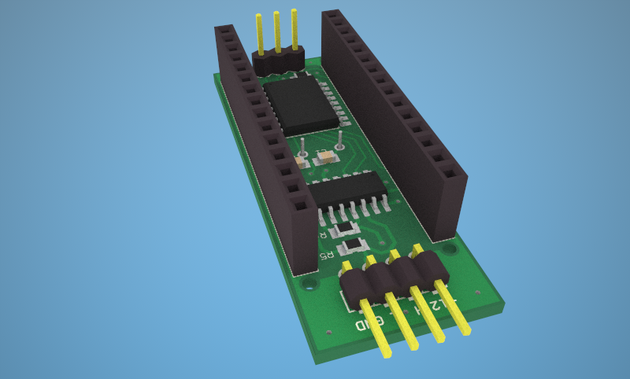
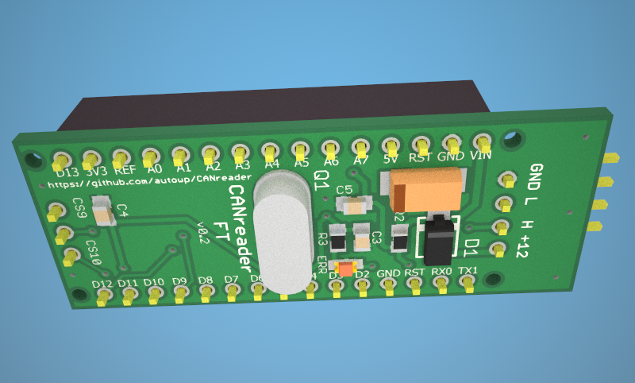
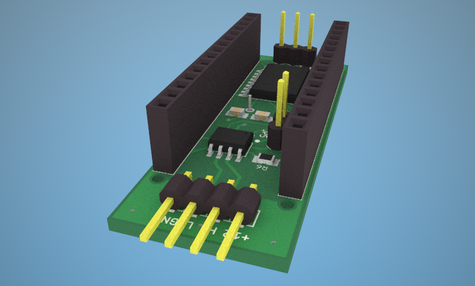
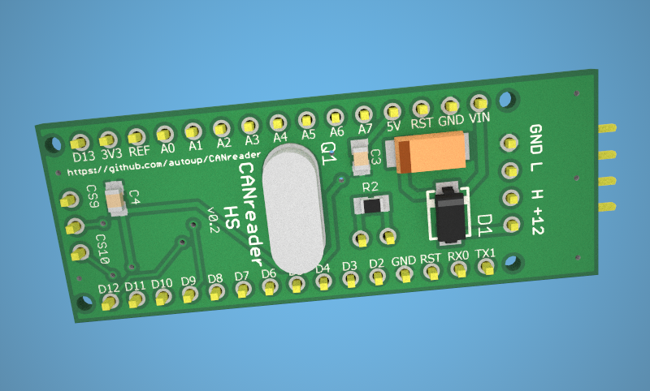

# Аппаратная часть CANreader на Arduino

В репозитории находятся проектные материалы для двух вариантов CANreader shield. Это историческая справочная документация: перед изготовлением и подключением проверьте схему, номиналы компонентов, ревизию платы и прошивку.

## CANreader-FT

Вариант рассчитан на отказоустойчивые CAN-трансиверы, например TJA1054/TJA1055.

[Открыть схему CANreader-FT](../i/canreader-ft.sch.png).

## CANreader-HS

Вариант рассчитан на высокоскоростную CAN. Проверьте тип трансивера, установленного на конкретной ревизии платы.

[Открыть схему CANreader-HS](../i/canreader-hs.sch.png).

## Контроллер, прошивка и подключение к приложению

В описанной аппаратной сборке используется Arduino Nano и CANreader shield. Прошивка находится в [репозитории CANreader](https://github.com/autowp/can-usb). Прошивка и последовательный/Bluetooth/сетевой мост должны поддерживать протокол CanHacker, который ожидает Android-приложение.

Приложение поддерживает USB serial, Bluetooth Classic SPP и совместимое с CanHacker подключение UDP. Для каждого способа требуется соответствующий интерфейс; Bluetooth и сетевой адаптер не встроены в shield по умолчанию. См. [поддерживаемые адаптеры](adapters.md) и [совместимость с Android](android.md).

## Предупреждение по сборке

Схемы и фотографии плат — справочные материалы, а не гарантия полноты каждого старого списка компонентов или ревизии платы. Перед сборкой и использованием проверьте полярность, распиновку, питание, тип CAN-трансивера и терминаторы по схеме и фактическим компонентам.
